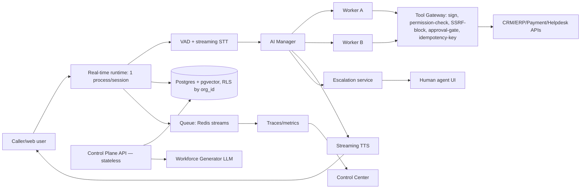
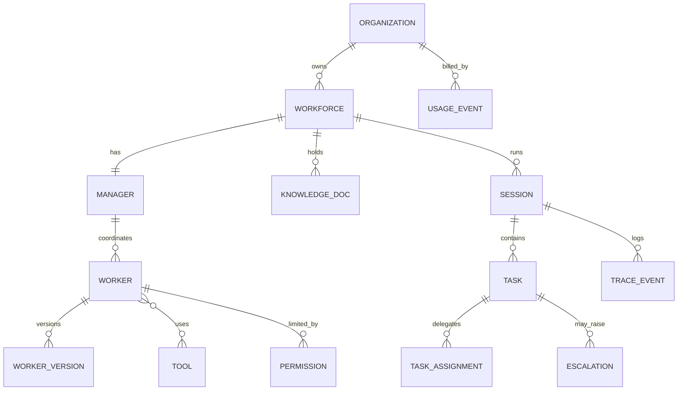
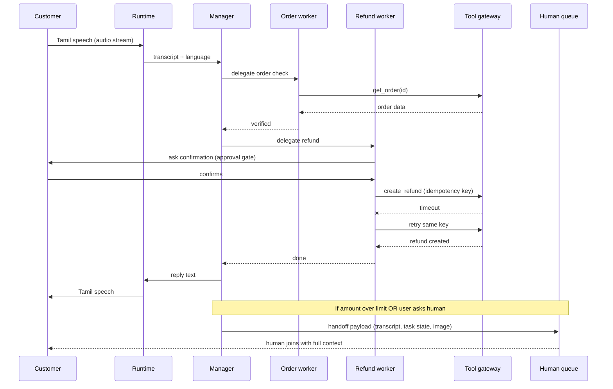

# MEMORY: AI Workforce Platform (India, Indic-voice, multi-agent support automation)
> Compact reference for build agent. Dense tables + graphs over prose. Read once, reuse.

## 0. ONE-LINE DEFINITION
Plain-language business need → generated team of narrow AI workers (manager + specialists) → speaks Indian languages by voice → acts on real business systems via gated tools → escalates to humans with full context → all versioned, tested, monitored.

## 1. NOT-THIS (avoid drift)
`NOT` chatbot | `NOT` single do-everything agent | `NOT` n8n (n8n = deterministic non-realtime automation) | `NOT` phone-first at MVP (web voice link first, phone deferred) | `NOT` full multimodal at MVP (image yes, video/screen deferred) | `NOT` self-host/white-label at MVP (SaaS first)

## 2. USERS
```
BUILD-SIDE                          TALK-SIDE
├─ Business owner (non-tech, SME)   ├─ Customer (voice, regional lang, code-switch)
├─ Developer/integrator (API)       └─ Employee/field staff (internal voice queries)
└─ Human agent/supervisor (escalation inbox)
```

## 3. WORKFORCE HIERARCHY (graph)
```
Organization
 └─ Workforce (e.g. Customer Support)
     └─ Manager (intent router, max_hops guard, shared task state)
         ├─ Worker: order_check   → tools[get_order]         → kb[shipping_policy]
         ├─ Worker: refund        → tools[create_refund]     → permission{approval:user_confirm, max_amount}
         ├─ Worker: complaint     → tools[create_ticket]
         └─ Worker: escalation    → tools[create_handoff]    → Human queue
     Workers reach: Order DB | CRM | Payment API | Helpdesk  (via Tool Gateway only)
```
RULE: workers = narrow, own prompt+tools+permissions. Manager never executes tools itself; only routes.

## 4. END-TO-END PRODUCT FLOW (graph)

```mermaid
flowchart LR
  A[Owner: plain-language requirement, text/voice] --> B[Intake: clarify up to 3 Qs]
  B --> C[Generator LLM: JSON spec]
  C --> D[Schema validate + safety lint]
  D --> E[Editable draft shown to owner]
  E --> F[Test harness: scripted/simulated calls, mocked tools]
  F --> G[Publish = immutable release]
  G --> H[Deploy: web voice link / embed widget / API]
  H --> I[Live session: customer talks]
  I --> J[Manager routes → Worker executes → Tool Gateway → real system]
  J --> K{escalate?}
  K -->|no| L[Reply via TTS]
  K -->|yes| M[Human queue: full transcript+state+attachments]
  L --> N[Traces + usage events → Control Center dashboard]
  M --> N
```


## 5. RUNTIME ARCHITECTURE (graph — components + data flow)

KEY SPLIT: **Control plane** = stateless REST (build/config/test/deploy/dashboard) writes immutable releases to Postgres. **Runtime** = stateful, one process per live call, streams audio, loads a release at session start. Dashboard outage never breaks a call.

## 6. COMPONENT TABLE (responsibility · failure mode+guard)
| Component | Responsibility/Tech | Failure→Guard |
|---|---|---|
| Requirement intake | text/voice → clean requirement | vague input → ask ≤3 Qs, proceed w/ stated assumptions |
| Workforce generator | LLM→strict JSON schema, then human-editable | invalid/unsafe spec → schema validation, tools limited to connected catalog, writes default to approval-required |
| Manager+Workers | intent classify→delegate→shared task state→reply. Plain state machine first (framework optional) | loops/cost blowup → max hops/turn, max tool calls, per-session token+cost caps, fallback-to-human |
| Voice pipeline | VAD→streaming STT→LLM stream→streaming TTS, barge-in cancels TTS+LLM on speech, per-language endpointing | provider stall → timeouts, circuit breaker, fallback provider, filler phrase on latency budget breach |
| Multimodal (image only@MVP) | image/doc on side channel → vision model describes → injected as untrusted tool-result into session state | injection via image/file → treat as untrusted data, size/type limits, malware scan |
| Multilingual layer | lang-ID on first utterance, per-lang provider map in config, code-switch via multilingual STT + LLM mirrors mix | wrong lang detected → re-detect each turn, user can override |
| Tool/integration gateway | sign webhooks, enforce per-worker permission, block private IPs (SSRF), approval gate for writes, idempotency keys | duplicate/unauthorized action → idempotency key per task step, least privilege, audit log |
| Knowledge base | upload→parse→chunk→embed→pgvector, top-k retrieval per worker scope, screen for injection phrases | stale/poisoned docs → source tracking, re-index button, retrieval scoped to org |
| Escalation service | triggers: user asks / low confidence / policy limit / repeated failure → human queue + handoff payload | no human available → callback request + ticket creation |
| Test harness | replay scripted/simulated turns vs draft version, mocked tools, scored | tests touch real systems → sandbox mode forces mock adapters |
| Deployment service | publish immutable release, scoped public keys, web/voice link + embed script, rollback | key leak → origin allowlist, short-lived session tokens, rate limits |
| Control Center | dashboard: live sessions, worker success/fail, escalations, latency, cost, trace drill-down | ingest lag → async queue, eventually-consistent dashboards |
| Auth/tenancy/metering | managed auth, org_id every row, Postgres RLS, usage events (minute+token) | cross-tenant leak → RLS + CI tests attempting cross-tenant reads |

## 7. GENERATED SPEC SCHEMA (contract — generator/runtime/test harness all share this)
```json
{
  "workforce": "Customer Support", "languages": ["ta","hi","en"],
  "manager": {"name":"Support Manager","routing":"intent","max_hops":4},
  "workers": [
    {"id":"order_check","instructions":"Verify order by ID","tools":["get_order"],"kb":["shipping_policy"]},
    {"id":"refund","instructions":"Refund damaged items","tools":["create_refund"],
     "permissions":{"create_refund":{"approval":"user_confirm","max_amount":2000}}},
    {"id":"escalation","tools":["create_handoff"]}
  ],
  "flow": ["order_check","refund"], "escalate_if": ["amount>2000","user_requests_human"]
}
```

## 8. DATA MODEL (ERD)

Every table: `org_id`. Key fields — `worker_version`(worker_id,spec_json,status,created_at,IMMUTABLE) · `tool`(type,endpoint,auth_ref,schema) · `permission`(worker_id,tool_id,mode:allow/approval/deny,limits) · `session`(channel,language,release_id,consent_flag) · `task`(state,idempotency_key,result) · `escalation`(reason,assignee,payload_json,status) · `trace_event`(session_id,span,worker_id,latency_ms,redacted_payload) · `usage_event`(metric,quantity,cost_estimate)

## 9. KEY SEQUENCE — live voice call w/ routing+approval+retry+escalation

OTHER 2 FLOWS (word form, no diagram needed):
- **Requirement→Workforce**: text/voice → intake → generator LLM → schema validate → editable draft → test run → publish release.
- **Multimodal turn**: image uploaded on side channel while audio streams → vision model describes → description enters session state as UNTRUSTED data → manager references it next reply.

## 10. TECH STACK (pick 1 col unless noted)
| Layer | Pick | Alt | Main risk |
|---|---|---|---|
| Frontend | Next.js+React+Tailwind | Vite+React | mic/audio perms on mobile browsers |
| Backend API | FastAPI (Python) | Node+Fastify | async mistakes under load |
| Voice framework | Pipecat / LiveKit Agents | hand-rolled WS | fast-changing APIs — DO NOT hand-build audio plumbing |
| VAD | Silero VAD | framework built-in | tuning for noisy Indian phone audio |
| STT | Indic streaming STT (Sarvam/Deepgram/Google) [VERIFY] | Whisper self-hosted | code-switch accuracy, free-tier minutes |
| LLM | fast hosted model: 1 for manager + small for workers [VERIFY name] | 2nd provider fallback | model retirement, rate limits |
| TTS | Indic streaming TTS | browser speech synth (demo only) | naturalness+latency |
| DB (relational+vector) | Postgres+pgvector (Supabase/Neon) | Qdrant+Postgres | free-tier size/connection caps |
| Cache/session | Redis (Upstash) | in-memory dev | command limits |
| Object storage | S3-compatible (R2/Supabase Storage) | local disk dev | egress cost |
| Queue | Redis streams + Python worker (arq) | Celery/cloud queue | dead-letter handling |
| Auth | Supabase Auth / Clerk | Auth0/self JWT | tenant-claim mistakes |
| Observability | OpenTelemetry + Langfuse/Grafana | Sentry only | logging PII by accident |
| Hosting | Fly.io/Render (runtime, ALWAYS-ON) + Vercel (UI) + GH Actions (CI) | Railway/single VPS | cold starts break voice → runtime must stay warm |

Data-flow learn order: browser mic(WebRTC/WS)→VAD→STT→LLM→TTS→audio back.
Common beginner mistakes: buffering full audio before STT | ignoring barge-in | forgetting org_id in a query | logging raw transcripts.

## 11. REPO LAYOUT
```
/apps/web        Next.js UI + Control Center
/apps/api        FastAPI control plane
/apps/runtime    Voice session service
/packages/spec   JSON schemas for workforce spec
/packages/tools  Tool adapters + mocks
/infra           docker-compose, migrations, CI
/tests           simulation scenarios
```
Local dev: `docker compose up` w/ `MOCK_PROVIDERS=1` → mock STT(reads text files), mock TTS(beep), stub LLM(canned JSON), mock CRM. No paid keys needed.

## 12. SECURITY CONTROLS (risk → control → plain meaning)
| Risk | Control (where) |
|---|---|
| Cross-tenant leak | Postgres RLS on org_id, CI-tested (db) |
| Key/token abuse | hashed keys, scoped short-lived session tokens, secret store (api/deploy) |
| Auth | managed auth, MFA admins, httpOnly cookies |
| Prompt injection (voice/text/image/doc/KB) | untrusted-data framing, injection screening, tools gated regardless of prompt (runtime/KB/gateway) |
| Unauthorized writes | least-privilege perms, approval gates, amount limits (tool gateway) |
| SSRF via tool URLs | block private/metadata IP ranges, domain allowlist (gateway) |
| Webhook spoof/replay | HMAC signature + timestamp window + nonce |
| PII/consent/DPDP [VERIFY] | recording-consent prompt, PII redaction in traces, retention timers, deletion API |
| Abuse/toll fraud/cost | rate limits, per-org spend caps, country allowlist, anomaly alerts |
| Audit/supply chain/uploads | append-only audit log, dependency scanning+lockfiles, file type/size checks+malware scan |

RELIABILITY: session state checkpointed in Redis (reconnect resumes) · circuit breakers w/ secondary STT/LLM/TTS per provider · exponential backoff→dead-letter queue visible in dashboard · graceful shutdown lets active calls finish · 1 idempotency key per task step · daily DB backups w/ tested restore.

## 13. MVP SCOPE CUT LIST
| In @ MVP | Deferred |
|---|---|
| Web voice link, embed widget | Phone/telephony, SSO |
| Image input (still) | Video input, screen understanding |
| 1 real tool connector, rest mocked | Full connector catalog |
| Manager + 2-3 workers | Full worker-type taxonomy |
| Hosted SaaS | Self-host, white-label, on-prem |
| Basic dashboard | Advanced analytics |
| Sandbox billing stub | Full billing |
| Sandbox/test-harness w/ mocks | Full DPDP tooling |

## 14. 8-WEEK BUILD PLAN
| Wk | Build | Exit test |
|---|---|---|
| 1 | repo, auth, tenancy+RLS, mock providers | 2 test orgs can't read each other's rows |
| 2 | voice loop EN: VAD/STT/LLM/TTS/barge-in | p95 latency measured, interrupt works |
| 3 | Indic langs, lang detect, code-switch | Tamil+Hindi scripted calls pass |
| 4 | Manager+2-3 workers, shared state, loop guards | correct routing on 20 test utterances |
| 5 | Tool gateway, 1 real action, approval gate, KB | refund runs once even on forced retry |
| 6 | Workforce generator+editor, test harness | sentence→runnable draft, sim run passes |
| 7 | Escalation w/ context, dashboard, deploy link | human sees full handoff; dashboard shows live call |
| 8 | Hardening, image input, demo rehearsal | 3 clean full runs |

## 15. 3-MIN DEMO SCRIPT
`0:00` type requirement→show generated team (30s) → `0:30` simulated test+trace (20s) → `0:50` publish, speak Tamil+English mixed (40s) → `1:30` upload damaged-item photo mid-call→routes Order→Refund→confirm→real refund fires (50s) → `2:20` ask for human→handoff screen w/ transcript+photo+state (25s) → `2:45` Control Center: live session, worker stats, escalation logged (15s).

## 16. RISKS → MITIGATION
| Risk | Mitigation |
|---|---|
| Latency > target on free tiers | stream everywhere, short prompts, smaller worker models, filler phrases |
| Weak Indic STT/TTS | benchmark providers early, per-language mapping |
| Free-tier limits hit mid-demo | pre-buy small paid credits, cached fallback demo |
| Model retired | model name in config only, 2nd provider ready |
| Generated workforce wrong | always editable draft + required test run |
| Agent loops/runaway cost | hop/token/spend caps |
| Prompt injection | permissions enforced OUTSIDE the model, always |
| Scope creep in 8wk | fixed MVP list + weekly exit tests |
| Telephony/compliance India | web link first, phone later [VERIFY rules] |
| Competitor copies idea | vertical templates, Indic depth, deep connectors (UPI/Tally/Zoho/couriers) |

## 17. COMPETITIVE GAP (why this ≠ existing tools)
| Category (examples) | Lacks vs this product |
|---|---|
| Voice-agent platforms (Vapi/Retell/Bland) | 1 agent per use-case; no requirement→team generation; no manager/worker structure; weaker Indic depth [VERIFY] |
| Conversational builders (Voiceflow) | hand-drawn flows only; no auto-generated workforce; limited multi-agent |
| Agent frameworks (LangGraph/CrewAI/AutoGen) | dev-only libraries; no voice pipeline/dashboard/tenancy/escalation/deploy out-of-box |
| Workflow automation (n8n/Zapier) | deterministic, non-realtime; no voice-first interaction or worker personas |
| Traditional IVR/chatbot | rigid, poor code-switching, script-limited actions |
| Indic voice providers (Sarvam/Bhashini/Krutrim/Google/Azure Indic) | components only; no orchestration/tools/dashboard/escalation |
Where THEY win: telephony+latency maturity (voice platforms), integration breadth (Zapier/n8n), dev flexibility (frameworks), enterprise compliance (large vendors) → integrate with these, don't fight on breadth.
Moat if copied: (1) vertical template library (retail/clinics/logistics/education) (2) deep Indian connectors (UPI/Tally/Zoho/couriers) (3) published per-language quality benchmarks (4) on-prem/data-residency option (5) early partners/resellers.

## 18. DELIVERY MODELS (priority order)
`1.Hosted SaaS`(MVP core) → `2.Embed widget/SDK`(low-med effort on top of SaaS) → `3.API-first/PaaS`(design API early, expose later) → `5.White-label/reseller`(after PMF) → `4.Self-hosted/on-prem`(defer, high effort, regulated buyers only)
Pricing [VERIFY]: free sandbox capped minutes + per-workforce monthly fee + per-minute usage w/ margin + enterprise custom. Validate in 5-10 pilots before fixing numbers.
GTM: 1 vertical first (D2C ecom / clinics / logistics), paid pilots w/ SMEs, sell via agencies/SIs, demo in customer's own language, web-link+WhatsApp before app-embed, price in INR, hackathon/case-study credibility.

## 19. OPEN QUESTIONS (ask user before building)
1. Which vertical + 1 real system to integrate first?
2. Web link only, or phone number too?
3. Which languages mandatory for demo?
4. Monthly budget for paid API credits?
5. Any data-residency requirement?

## 20. GUARDRAIL PRINCIPLES (never violate — repeat to self before coding)
1. LLM proposes, code disposes — manager/workers never execute tools directly; guard layer validates every call.
2. Every write tool needs: permission mode + approval threshold + idempotency key.
3. External/retrieved content (images, docs, KB chunks, user speech) = always untrusted; never auto-becomes instruction.
4. Every DB table has org_id + RLS; test cross-tenant reads in CI.
5. Config-as-data: workforce spec is immutable JSON per version; no silent prod changes.
6. Cap everything: hops/turn, tool calls/turn, tokens/session, spend/org/day.
7. Runtime (stateful, always-on) is architecturally separate from control plane (stateless API).
8. Ship editable draft + mandatory test run before any publish.
